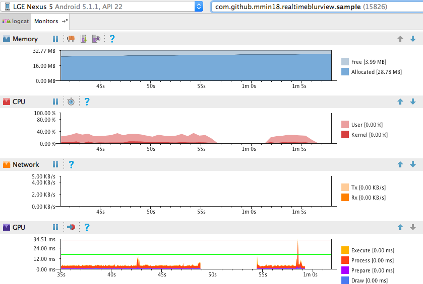

# RealtimeBlurView

It's just a realtime blurring overlay like iOS UIVisualEffectView.


Just put the view in the layout xml, no Java code is required.

	// Views to be blurred
	<ImageView ../>
	
	<com.github.mmin18.widget.RealtimeBlurView
		android:layout_width="match_parent"
		android:layout_height="match_parent"
		app:realtimeBlurRadius="20dp"
		app:realtimeOverlayColor="#8000" />
	
	// Views above blurring overlay
	<Button ../>

Try the sample apk: [blurring.apk](imgs/blurring.apk)

# Adding to project

Add dependencies in your `build.gradle`:

```groovy
	dependencies {
	    compile 'com.github.mmin18:realtimeblurview:1.1.2'
	}
	android {
		buildToolsVersion '28.0.3'                 // Use 28.0.3 or higher
		defaultConfig {
			minSdkVersion 15
			renderscriptTargetApi 19
			renderscriptSupportModeEnabled true    // Enable RS support
		}
	}
```

Add proguard rules if necessary:

```
-keep class androidx.renderscript.** { *; }
```

# Limitations

- Adding multiple RealtimeBlurView (even not visible) may hurt drawing performance, like use it in ListView or RecyclerView.

- It will not work with SurfaceView / TextureView like VideoView, GoogleMapView

# Performance

RealtimeBlurView use RenderScript to blur the bitmap, just like [500px-android-blur](https://github.com/500px/500px-android-blur).

Everytime your window draw, it will render a blurred bitmap, so there is a performance cost. Set downsampleFactor>=4 will significantly reduce the render cost. However, if you just want to blur a static view, 500px-android-blur is good enough.

I've run the sample on some old phones like Samsung Galaxy S2, Samsung Galaxy S3, it runs at full FPS. Here is a performance chart while scrolling the list on Nexus 5.



# Changelog

### 1.1.2 (2018-05-28)

Bug fix (Draw overlay color in rect).

### 1.1.1 (2018-05-22)

Fix downsample factor issue when blur radius is very big.

### 1.1.0 (2017-01-02)

Some improvements (OOM, resize, window background)

### 1.0.8 (2016-11-29)

Fix view not refreshed issue on PopupWindow

### 1.0.6 (2016-11-7)

Fix crash when view is very small (draw at least 1px)

### 1.0.5 (2016-11-5)

Support Popup Window (Use it as dialog background)
Ignore UnsatisfiedLinkError if APK is not debuggable.

### 1.0.4 (2016-9-28)

Support custom shape (by override drawBlurredBitmap()), support view in ContextThemeWrapper.
